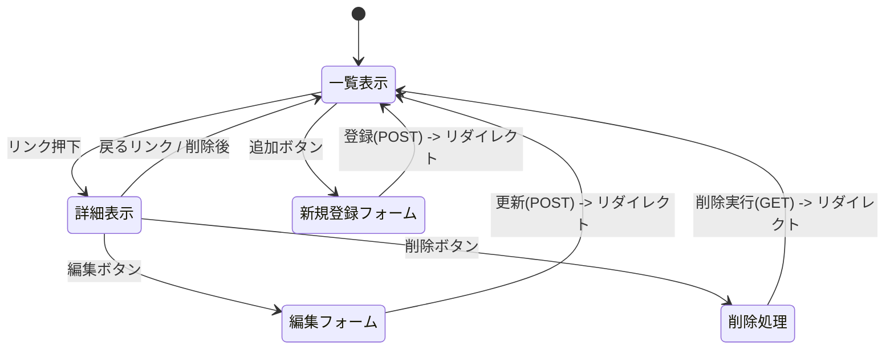

# 開発者向け仕様書（仮）
お気に入りのアルバムのリストを表示する．

## データ構造
アルバムの一覧表

プロパティ名 | 型 | 説明 | 備考 |
-|-|-|-
"id" | int | アルバムのID | 1から順番に数字を与える（登録や削除時に編集する）
"title" | str | アルバムのタイトル | ー
"artist" | str | アーティスト名 | ー
"year" | int | 発売年 | ー
"time" | int | 総再生時間 | ー
"price" | int | 価格 | ー

## ページ遷移

### ページ遷移方法

### HTTPメソッドとリソース名

機能 | HTTPメソッド | リソース名 | 処理内容 |
-|-|-|-
一覧表示 | GET | /albums | 保存されたアルバム一覧を表示する．
新規登録フォーム | GET | /albums/new | 新規データを入力するフォームを表示する．
詳細表示 | GET | /albums/:id | 指定IDのアルバムの詳細を表示する．

### 追加・削除・編集後に表示する内容

処理が完了した後，アルバム一覧画面に戻る．

## リソースごとの機能の詳細
機能 | 詳細表示内容 | 追加・編集フォーム入力項目 | 処理詳細 |
-|-|-|-
一覧表示 | id,title,artist,year | ー | ー
詳細表示 | 全てのプロパティを表示する． | ー | ー
新規登録 | ー | id以外のプロパティ全て | 新しいデータを配列に追加して新しいIDを与える．
編集・更新 | ー | id以外の全てのプロパティ | 指定されたIDのデータを上書き保存する．
削除 | ー | ー | 指定されたIDのデータを配列から削除する．

前期の授業アンケートの結果を表示する．

## データ構造
前期授業の一覧表

プロパティ名 | 型 | 説明 | 備考 |
-|-|-|-
"id" | int | 授業のID | 1から順番に数字を与える（登録や削除時に編集する）
"title" | str | 科目名 | ー
"teacher" | str | 教員指名 | ー
"room_number" | int | 教室番号 | ー
"days" | str | 開講曜日 | ー

## ページ遷移

### ページ遷移方法

### HTTPメソッドとリソース名

機能 | HTTPメソッド | リソース名 | 処理内容 |
-|-|-|-
一覧表示 | GET | /surveys | 保存された授業一覧を表示する．
新規登録フォーム | GET | /surveys/new | 新規授業を入力するフォームを表示する．
詳細表示 | GEt | /surveys/:id | 指定IDの授業詳細を表示する．
編集フォーム | GET | /surveys/edit/:id | 指定IDの授業を編集するフォームを表示する．

### 追加・削除・編集後に表示する内容

処理が完成した後，授業一覧画面に戻る．

## リソースごとの機能の詳細

機能 | 詳細表示内容 | 追加・編集フォーム入力項目 | 処理詳細 |
-|-|-|-
一覧表示 | id,title,teacher,days | ー | ー
詳細表示 | 全てのプロパティ | ー | ー
新規登録 | ー | id以外の全てのプロパティ | 新しいデータを配列に追加し，新しいIDを与える．
編集・更新 | ー | id以外の全てのプロパティ | 指定されたIDのデータを上書き保存する．
削除 | ー | ー | 指定されたIDのデータを配列から削除する．

アニメ「ドロヘドロ」のエピソード一覧を表示する

## データ構造
エピソード一覧表

プロパティ名 | 型 | 説明 | 例 |
-|-|-|-
"id" | int | エピソードのID | 1
"ep_number" | int | 話数 | "魔の１"
"title" | str | タイトル | ”カイマン”
"summary" | str | あらすじ | "魔法使い狩りをする男．．．"

## ページ遷移

### ページ遷移方法

### HTTPメソッドとリソース名

機能 | HTTPメソッド | リソース名 | 処理内容 |
-|-|-|-
一覧表示 | GET | /dorohedoro | 保存されたエピソード一覧を表示する．
新規登録フォーム | GEt | /dorohedoro/new | 新規データを入力するフォームを表示する．
詳細表示 | GEt | /dorohedoro/:id | 指定IDのエピソードの詳細を表示する．
編集フォーム | GET | /dorohedoro/edit/:id | siteiIDのエピソードを編集するフォームを表示する．

### 追加・削除・編集後に表示する内容

処理が完成した後，必ずエピソード一覧表の画面に戻る．

## リソースごとの機能の詳細

機能 | 詳細表示内容 | 追加・編集フォーム入力項目 | 処理詳細 |
-|-|-|-
一覧表示 | id,ep_number,title | ー | ー 
詳細表示 | 全てのプロパティ | ー | ー
新規登録 | ー | id以外の全てのプロパティ | 新しいデータを配列に追加して新しいIDを与える．
編集・更新 | ー | id以外の全てのプロパティ | 指定されたIDのデータを上書き保存する．
削除 | ー | ー | 指定されたIDのデータを配列から削除する．